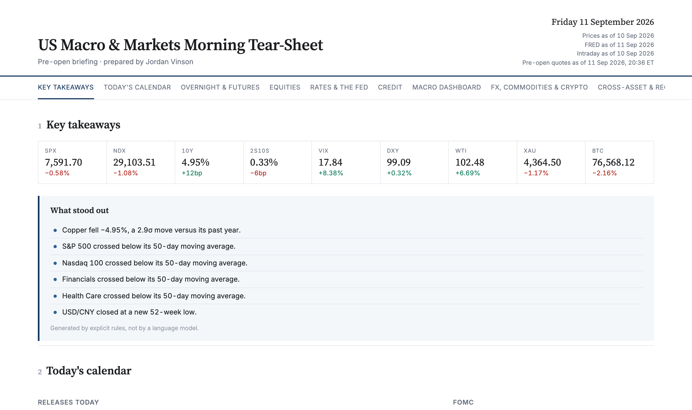
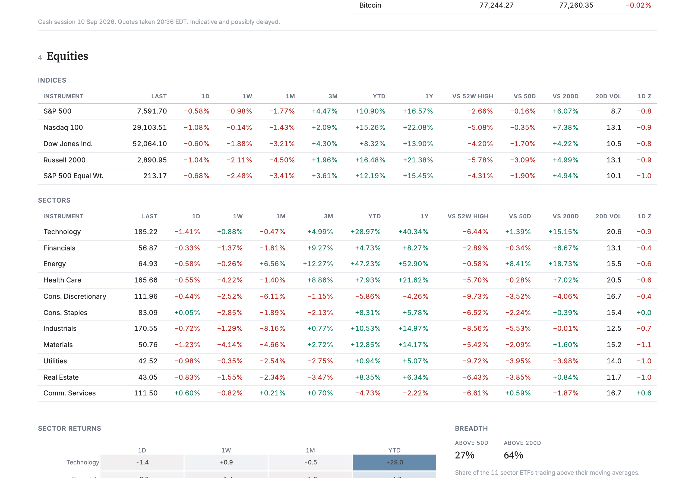
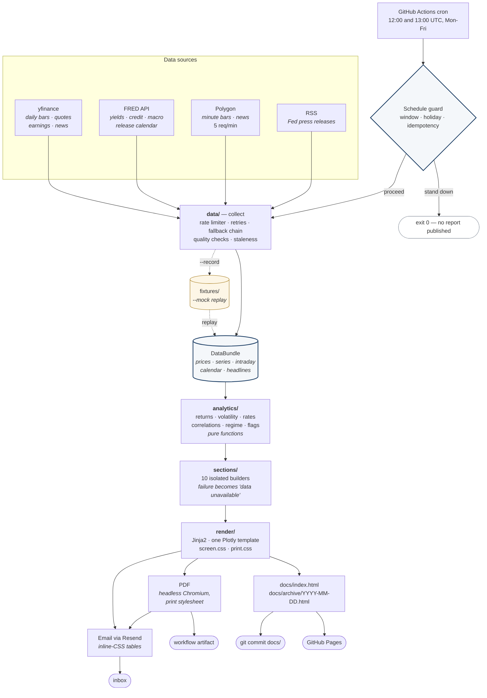

# US Macro & Markets Morning Tear-Sheet

[](https://JordanVinson7.github.io/us-macro-tearsheet/)
[](https://github.com/JordanVinson7/us-macro-tearsheet/actions/workflows/ci.yml)
[](https://github.com/JordanVinson7/us-macro-tearsheet/actions/workflows/daily.yml)
[](https://www.python.org/)
[](LICENSE)

An automated pre-open briefing on US markets and the US economy. Every trading
day before the open, a GitHub Actions workflow pulls market and economic data,
computes analytics, and publishes an interactive HTML tear-sheet, a print-ready
PDF, and an email summary — with no server to run and nothing to maintain by
hand.

**→ [View today's sheet](https://JordanVinson7.github.io/us-macro-tearsheet/)**  ·  **[Archive](https://JordanVinson7.github.io/us-macro-tearsheet/archive/)**



---

## Contents

- [What it does](#what-it-does)
- [Architecture](#architecture)
- [Data sources](#data-sources)
- [Methodology](#methodology)
- [Running it yourself](#running-it-yourself)
- [Configuration](#configuration)
- [Design decisions and trade-offs](#design-decisions-and-trade-offs)
- [Known limitations](#known-limitations)
- [Testing](#testing)
- [Project layout](#project-layout)
- [Licence and disclaimer](#licence-and-disclaimer)

---

## What it does

Ten sections, in the order a reader actually wants them:

| # | Section | Contents |
|---|---|---|
| 1 | **Key takeaways** | Nine-figure KPI strip, and a "What stood out" panel generated by explicit rules |
| 2 | **Today's calendar** | Economic releases today and for the week, the next FOMC decision, notable earnings split before-open / after-close |
| 3 | **Overnight & futures** | Equity futures against the prior cash close, plus overnight moves in rates, the dollar, oil, gold and bitcoin |
| 4 | **Equities** | Index and sector performance across six windows, sector heatmap, breadth, relative-value ratios, YTD chart, and the previous session's intraday panel |
| 5 | **Rates & the Fed** | Treasury curve against 1w/1m/1y ago, yields in basis points, a classified curve move, spread history, real rates, breakevens and policy rates |
| 6 | **Credit** | High-yield and investment-grade OAS with level, change, percentile, z-score and history |
| 7 | **Macro dashboard** | Sixteen indicators with latest, prior, change, year-on-year, observation date and next scheduled release, plus five-year trend charts |
| 8 | **FX, commodities & crypto** | Performance tables, and the copper/gold ratio against the 10-year yield |
| 9 | **Cross-asset & regime** | 60-day correlation matrix, stock–bond correlation, VIX term structure, volatility percentiles, and a risk regime composite with per-component contributions |
| 10 | **Headlines** | Six to ten deduplicated market headlines |



Plus a footer carrying **per-section data provenance**, **methodology notes for
every metric**, a data-quality report, and the disclaimer.

### Features worth calling out

- **Every section fails independently.** One dead API costs you one section with
  a visible "data unavailable" note — never the page, and never the email.
- **Provenance is shown, not assumed.** If a figure came from a fallback source,
  the footer says so, per section.
- **Honest gaps.** Where there isn't enough history for a metric, the page shows
  `n/a` rather than a number computed from too little data.
- **Rule-based flags, no LLM.** Every line in "What stood out" comes from an
  inspectable rule with a threshold in `config.yaml`, so it is reproducible and
  you can always answer "why did that appear?".
- **Offline mock mode.** `--mock` renders the entire page from committed
  fixtures with zero API calls, so templates and CSS can be developed without
  touching a rate limit.

---

## Architecture



The seam that matters is **`DataBundle`**. Everything above it talks to the
internet; everything below it is deterministic. That is what lets `--mock`
replay a recorded bundle with no other code change, and what keeps the
analytics layer pure enough to test in under two seconds.

---

## Data sources

| Domain | Source | Notes |
|---|---|---|
| Daily prices (41 tickers) | **yfinance** | Batched requests, exponential backoff, dividend-adjusted |
| Pre-open quotes | **yfinance** | Documented exception — Polygon's free tier has no snapshot endpoint |
| Previous-session minute bars | **Polygon** | 4 calls, regular session only (09:30–16:00 ET) |
| Yields, credit spreads, macro (36 series) | **FRED** | Series IDs validated at startup |
| Release calendar & FOMC | **FRED** + `config.yaml` | Release IDs resolved by name, never hardcoded |
| Notable earnings | **yfinance** | Curated large-cap watchlist |
| Headlines | **Polygon**, **yfinance**, **RSS** | Deduplicated by token overlap |
| Trading calendar | **exchange_calendars** | NYSE (`XNYS`) sessions and holidays |

**Fallback chain for prices.** Yahoo throttles cloud IPs, so when a ticker is
missing the pipeline tries, in order: Polygon's grouped-daily endpoint (one call
covers every US stock and ETF, but yields only the latest level), then a mapped
set of FRED series (slower to update, but carries full history). Whatever
supplied each ticker is recorded and shown in the footer.

---

## Methodology

Every figure on the page is defined here, and the same notes appear in the
page footer.

### Returns and prices

| Metric | Definition |
|---|---|
| **1D / 1W / 1M / 3M / 1Y returns** | Simple percentage change over 1, 5, 21, 63 and 252 **trading** days |
| **YTD** | Measured from the **final close of the previous calendar year**, not the first close of January — using January's open would silently discard the turn-of-year move |
| **Total return** | Prices are dividend-adjusted, so multi-month returns on dividend-paying ETFs are total returns |
| **vs 52-week high** | Percentage below the trailing 252-session high, shown as a negative number |
| **vs 50d / 200d** | Percentage distance of the latest close from its simple moving average |
| **Breadth** | Share of the 11 sector ETFs above their moving average. Members without a full window are excluded from *both* numerator and denominator |

### Risk measures

| Metric | Definition |
|---|---|
| **Realised volatility** | Annualised standard deviation of daily simple returns over 20 sessions (×√252) |
| **Volatility percentile** | Rank of current realised volatility within its own trailing 252 observations |
| **1-day return z-score** | Latest daily return against its trailing 252-session distribution. `n/a` below 30 clean observations |
| **Percentile** | Share of the distribution at or below the current value, so "95th percentile" means only 5% of history was higher |
| **Intraday volatility** | Annualised from minute returns (×√(390 × 252)) |

### Rates

| Metric | Definition |
|---|---|
| **Yields** | FRED constant-maturity series, published with a one- to two-day lag. **Every figure carries its observation date** |
| **Changes** | Basis points (1 percentage point = 100bp) |
| **Historical curves** | The last observation **on or before** the target date, because the series skip weekends and holidays |
| **Curve move** | *Bull* = yields fell, *bear* = yields rose, *twist* = the ends moved oppositely. *Steepener* / *flattener* from the change in the 10Y−2Y spread. Moves under 2bp are reported as "little changed" rather than dressed up as a direction |
| **Inversion** | A spread below zero by more than a 2bp tolerance — the tolerance stops a curve sitting at zero from flipping state daily |

### Credit

Option-adjusted spreads over Treasuries, in percentage points; changes in basis
points. Percentiles and z-scores use up to 252 sessions, **clamped to available
history** — the ICE BofA series on FRED begin in September 2023, so the window
is about three years, and the page says so.

### Macro

Transforms are declared per series in `config.yaml`: year-on-year for price
indices, three-month average change for payrolls, four-week average for jobless
claims, month-on-month for retail sales and industrial production.

**Year-on-year uses the convention the series deserves**, which is subtler than
it sounds:

- a **rate** (unemployment, GDP growth) is differenced into **percentage points** — 4.3% → 4.1% is −0.2pp, not "−4.65%";
- a series that **crosses zero** (diffusion indices, the NFCI) is differenced into **points** — dividing by a near-zero base produced "+6671%" before this was fixed;
- everything else is a **percentage change**.

**Staleness** is a missed release, not age. FRED dates an observation at the
*start* of its period — August CPI is dated `2026-08-01` but published in
mid-September — so age alone would flag every current monthly series. A series
is stale only once its next scheduled release date has passed without new data.

### Cross-asset and regime

**Correlations** use 60 sessions of daily changes. Credit spreads are
**differenced in basis points**, not percentage-changed: a spread moving 2.70% →
2.80% is +10bp, and calling that "+3.7%" is meaningless and explodes near zero.

**Risk regime composite.** Each component is z-scored against its own trailing
504 sessions, multiplied by a sign (+1 where higher means more risk-off) and a
configured weight:

| Component | Weight | Sign |
|---|---|---|
| VIX level | 0.20 | + |
| VIX term structure (VIX/VIX3M) | 0.15 | + |
| High-yield OAS | 0.20 | + |
| SPX vs 200-day MA | 0.15 | − |
| Stock–bond correlation | 0.10 | + |
| USD 1-month momentum | 0.10 | + |
| Chicago Fed NFCI | 0.10 | + |

Components with no usable data are **dropped and the remaining weights
re-normalised**, and the page reports how many contributed. Treating a missing
input as zero would quietly drag the composite toward neutral and present it as
a complete reading.

Z-scores are **rolling, never full-sample** — each historical point is scored
only against data available at that time, so the history chart contains no
lookahead.

> The composite is a **descriptive summary of conditions relative to recent
> history. It is not a forecast, a recommendation, or a trading signal.**

### Flags

| Rule | Default threshold |
|---|---|
| Large daily move | \|z\| > 2.0 versus the trailing year |
| New 52-week high or low | full 252-session window required |
| Moving-average cross | crossed and cleared by > 0.15% |
| VIX backwardation | VIX/VIX3M ≥ 1.00 |
| Curve inversion / un-inversion | 2bp tolerance |
| Credit spread move | > 10bp in a day |

Flags are ranked by severity then magnitude and trimmed to twelve. A quiet
session legitimately produces none, and the panel says so.

### Data quality

- Non-positive prices are dropped; a NaN latest close fails the ticker.
- A price series whose most recent bar is more than 7 days old is **dropped
  rather than presented as current** — Yahoo does this to thinly-followed
  symbols.
- Implausible one-day moves (25% default, 40% crypto, 80% volatility indices)
  are flagged, the **level kept** and only the **return across that date
  suppressed**. On continuous futures these are contract rolls: the price steps
  to a new contract and stays there, so the "return" is an artefact of the
  series, not a market move. Deleting the row would corrupt the level; keeping
  the return would corrupt every volatility and z-score derived from it.

---

## Running it yourself

```bash
git clone https://github.com/JordanVinson7/us-macro-tearsheet.git
cd us-macro-tearsheet

conda create -y -n tearsheet python=3.12 && conda activate tearsheet
# or: python3.12 -m venv .venv && source .venv/bin/activate

pip install -r requirements.txt
playwright install chromium          # only needed for PDF output
```

**Render the whole sheet offline, with no API keys and no network:**

```bash
python -m tearsheet run --mock --open
```

**With live data**, copy `.env.example` to `.env` and fill in your keys:

```bash
cp .env.example .env
python -m tearsheet run --no-email --force --open
```

### CLI

```
python -m tearsheet run [options]

  --mock        Render from committed fixtures. No network calls at all.
  --record      Save this run's data as fixtures for --mock.
  --force       Bypass the schedule guard and overwrite today's sheet.
  --no-email    Skip email delivery.
  --no-pdf      Skip PDF rendering.
  --publish     Write into docs/ (for GitHub Pages) instead of output/.
  --open        Open the result in your browser.
  -v            Debug-level logging.
```

Local runs write to `output/` (gitignored), so they can never collide with the
`docs/` tree that CI commits.

### Credentials

| Variable | Purpose | Free tier |
|---|---|---|
| `FRED_API_KEY` | Yields, credit, macro, calendar | [Free, instant](https://fredaccount.stlouisfed.org/apikeys) |
| `POLYGON_API_KEY` | Intraday minute bars, news | Free, 5 requests/minute |
| `RESEND_API_KEY` | Email delivery | Free, 100/day |
| `EMAIL_TO` | Recipient | — |
| `SITE_URL` | Link in the email | — |

---

## Configuration

Everything non-secret lives in [`config.yaml`](config.yaml) — 482 lines, no
Python required to change any of it:

- the **universe** (41 tickers, 36 FRED series) with display names and transforms
- **analytics windows** — return periods, volatility window, lookbacks
- **flag thresholds** and the regime weights and signs
- the **publish window**, exchange calendar and archive retention
- **per-section on/off toggles**

Configuration is parsed into Pydantic models with `extra="forbid"`, so a typo
raises at startup naming the exact path rather than silently disabling a
feature that then quietly goes missing from the page.

---

## Design decisions and trade-offs

**Why GitHub Actions rather than a server or a cloud function?**
The job is a few minutes of work once a day. A VM would cost money and need
patching; a Lambda would need packaging, a scheduler and a place to put the
output. Actions gives cron, a runtime, secret storage, artifact hosting and a
static site in one free product, and the workflow file is version-controlled
next to the code that it runs. The cost is a cold start each morning —
irrelevant when the deadline is "before the open".

**Why publish to a committed `docs/` folder?**
Pages serving from `main`/`docs` means the published output is part of the
repository's history, so `git pull` gives you every past sheet locally, and the
archive is diffable. The cost is repository growth, which is why the archive is
pruned to a configurable window (120 days by default) while pruned dates stay
listed in the index.

**Why Resend?**
SMTP from a CI runner means storing a mail password and fighting spam
classification. Resend is an HTTP API with a free tier and a three-line SDK
call. The trade-off is the free plan's restriction: the sender must be
`onboarding@resend.dev` and mail is delivered **only to the address the account
was registered with**. For a personal briefing that costs nothing; for anything
else it would need a verified domain.

**How rate limits are handled.**
Polygon's free tier allows 5 requests per rolling 60 seconds. A fixed-window
limiter lets you fire 5 calls at 11:59:59 and 5 more at 12:00:01 — 10 calls in
two seconds, which is exactly what triggers 429s. The limiter here keeps a deque
of call timestamps and blocks **pre-emptively**, and the run budget is
deliberately small (5 calls: four minute-bar requests plus news). A
server-supplied `Retry-After` always beats the computed exponential backoff.

**Why the analytics layer is pure.**
No I/O, no config objects, no logging — just pandas in, values out. The entire
suite runs in about two seconds, which means it actually gets run. It also
forces the thresholds into `config.yaml` instead of being scattered through the
code.

**Why Plotly from a CDN.**
The page carries 14 charts. `plotly.io.to_html` embeds the ~3MB library **per
figure** by default; loading it once from a CDN instead keeps the page at about
520KB rather than 40MB+. The trade-off is a dependency on a third-party CDN,
which is why the version is pinned.

**Why the stylesheet is inlined.**
An archived sheet from six months ago still renders exactly as it did on the
day. A linked stylesheet would silently restyle history every time the CSS
changed.

**Why fixtures are CSV and JSON rather than pickle.**
More code to write, but diffable in git, inspectable in an editor, and no
arbitrary-code-execution risk in a public repository.

---

## Known limitations

- **`^VIX3M` is unavailable.** Yahoo stopped updating it (last bar 17 July
  2026), so it is dropped rather than shown stale. The VIX term-structure chart
  reports unavailable and the regime composite runs on six of seven components
  — which it states on the page.
- **Intraday is previous-session only.** Polygon's free tier has no snapshot
  endpoint, so live pre-open levels come from Yahoo and are indicative.
- **FRED yields lag one to two days.** Every figure carries its observation
  date; the sheet does not pretend otherwise.
- **ISM PMI is not on FRED.** The Empire State and Philadelphia Fed
  manufacturing surveys stand in, labelled `proxy` on the page.
- **Credit spread history is short.** The ICE BofA series on FRED begin in
  September 2023, so percentiles use about three years.
- **Continuous futures roll.** Returns spanning a detected roll are suppressed
  rather than shown — which is why silver and natural gas can show `n/a` for
  YTD and 1Y while shorter windows are populated.
- **`USD/CNH` substituted.** Yahoo serves no daily history for `CNH=X`, so the
  onshore fix `CNY=X` is used and labelled as such.
- **Earnings notability is a curated list**, not a live market-cap screen —
  fetching a market cap per name is the slowest call in yfinance and the main
  rate-limit risk.
- **Scheduled workflows can be disabled.** GitHub's documentation states that
  *"in a public repository, scheduled workflows are automatically disabled when
  no repository activity has occurred in 60 days"*. It does **not** define what
  counts as activity, and does **not** say whether the bot commits this workflow
  makes with `GITHUB_TOKEN` reset the timer — so do not rely on them. See below.

### If the daily workflow stops running

Re-enable it from **Actions → Daily tear-sheet → Enable workflow**.

To reduce the chance of it happening, either push to the repository yourself
occasionally, or have the daily commit authored by a real account: create a
personal access token with `contents: write`, store it as a secret, and use it
in place of the default `GITHUB_TOKEN` in the checkout step. A commit attributed
to a user account is unambiguously repository activity, whereas the behaviour of
`GITHUB_TOKEN` commits is undocumented.

---

## Testing

```bash
pytest            # 241 tests, ~2 seconds
ruff check .
ruff format --check .
```

CI runs all three on every push. **No API keys are required** — the suite runs
entirely on synthetic data and the committed fixtures, so it never touches a
rate limit.

What is covered, and why these in particular:

| Area | Examples |
|---|---|
| **Analytics** | Hand-computed volatility and z-scores; a test that the rolling z-score **cannot look ahead**; every branch of the curve classification |
| **Contract rolls** | That an unfiltered roll inflates 20-day volatility from <1% to >50%, and that a window *after* a roll is still computed |
| **Rate limiter** | Burst, block and rolling-window release, driven by a fake clock so it is instant and deterministic |
| **Schedule guard** | The full decision table, including that *both* UTC cron firings qualify and the second stands down |
| **Rendering** | The entire page built from fixtures — which is what catches a broken template before a 07:00 cron run does |
| **Email** | That the body contains no `<style>` block, script, web font or chart, since Outlook strips them |
| **Secrets** | That a presence report never exposes a value, and placeholder values are treated as missing |

---

## Project layout

```
tearsheet/
  __main__.py  cli.py      entry point and CLI
  config.py                config.yaml + .env, validated with Pydantic
  models.py                types that cross package boundaries
  observability.py         logging, secret redaction, the run report
  guard.py                 the schedule decision
  pipeline.py              orchestration and the section isolation boundary
  data/                    yfinance · fred · polygon · news · calendar ·
                           earnings · fallbacks · quality · sessions ·
                           fixtures · bundle
  analytics/               returns · volatility · transforms · rates ·
                           correlations · regime · flags   (pure functions)
  sections/                one isolated builder per page section
  charts/                  Plotly template · timeseries · heatmaps
  render/                  Jinja2 templates, screen.css, print.css
  delivery/                pdf · email · publish
tests/                     13 files, 241 tests
fixtures/                  recorded data for --mock
docs/                      published site (committed by CI)
config.yaml                the entire universe and every threshold
```

Roughly 9,700 lines of Python across 53 modules, 2,200 lines of tests, 1,050
lines of Jinja templates and 475 of CSS.

---

## Licence and disclaimer

[MIT](LICENSE).

> This tear-sheet is produced automatically for **education and information
> only**. It is not investment advice, nor a recommendation to buy or sell any
> security. Data may be delayed, incomplete or incorrect. The risk regime
> composite is a descriptive indicator, not a trading signal.
